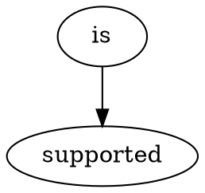

# Embeds code for most syntaxes supported by `Markdown.sublime-syntax`.

```xml
<tag>XML is supported</tag>
```

```ruby
def ruby_is
  puts "Supported"
end
```

```c
int main() {
    printf("C is supported");
}
```

```js
function javascript() {
    console.log("is supported");
}
```

```c#
foreach (int c_sharp in is_supported) {
    Console.Write("you bet");
}
```


```java
class JavaIs {
    void supported() { }
}
```

```python
def python_is_supported():
    pass
```

```bash
echo "Bash is supported"
```

```c++
template <class CPlusPlus>
float Is(float supported) {
    return 42.0f;
}
```

```go
func go_is_supported() {
    // yep
}
```

```rust
fn rust_also_works() {
    println!("Would be weird if not"); // don't you agree?
}
```

```php
elseif ($php_is_here == 3) {
}
```

```sql
-- sql syntax
create table is_here
```



```json
{
    "is": "supported",
    "yep": true
}
```

```r
r_too_is_here <- c(1,2,3)
```

```objective-c
// Incomplete Objective code
@interface Incomplete : NSObject
```

```objective-c++
// Incomplete Objective-C++ code
@interface Incomplete : NSObject
```
